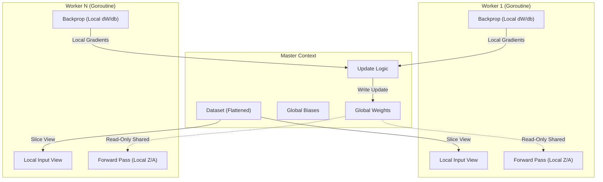

# neuro-go

**neuro-go** is a concurrent implementation of a fully connected Deep Neural Network (DNN) written in Go.

This project investigates the performance characteristics of synchronous data parallelism within a garbage-collected environment. The primary design goal is the elimination of runtime memory allocations during the training loop ("zero-allocation") to mitigate Garbage Collector (GC) latency and maximize CPU cache locality through flattened memory layouts.

## Project Overview

Standard deep learning implementations often rely on external C/C++ bindings (e.g., BLAS, CUDA). `neuro-go` explores a pure Go approach, leveraging Go's native concurrency primitives (`goroutines`, `channels`, `sync`) to implement a distributed-memory style training architecture on a single shared-memory machine.

### Core Objectives
1.  **Memory Optimization:** Implementation of a custom linear algebra engine utilizing 1D slice backing arrays to ensure row-major cache locality.
2.  **GC Mitigation:** Utilization of pre-allocated scratchpads for forward activation ($Z, A$) and backward gradients ($dZ, dW$), ensuring steady-state training generates near-zero garbage.
3.  **Concurrency:** Implementation of Synchronous Data Parallelism using a Master-Worker topology.

## System Architecture

The system follows a synchronous parameter server model adapted for local execution.

* **Global State:** The Master process holds the canonical model parameters (Weights and Biases).
* **Worker Isolation:** To avoid mutex contention during the computation phase, the model structure is cloned for each worker. Workers share read-only pointers to the global weights but maintain unique, pre-allocated buffers for local activations and gradients.
* **Aggregation:** Gradients are computed locally by workers and aggregated synchronously by the Master at the end of each batch.


## Implementation Details

### Data Structures
* **Matrix:** Defined as a struct containing dimensions and a flattened `[]float64` slice. This avoids the pointer indirection overhead associated with `[][]float64` and allows for memory-aligned operations.
* **Layer:** Encapsulates the network topology. It differentiates between shared parameters (pointers to Master matrices) and local state (worker-owned matrices).

### Mathematical Formulation
The network implements the following standard components:

* **Initialization:** He Initialization ($\sqrt{2/n_{in}}$).
* **Activation:** ReLU for hidden layers; Stable Softmax for the output layer.
* **Loss Function:** Categorical Cross-Entropy.
* **Optimization:** Mini-batch Stochastic Gradient Descent (SGD).

## Getting Started

### Prerequisites
* Go 1.20 or higher.
* MNIST training data (`mnist_train.csv`) located in the project root.

### Installation
```bash
git clone [https://github.com/b0tShaman/neuro-go.git](https://github.com/b0tShaman/neuro-go.git)
cd neuro-go
```
### Execution
To initiate training:

```bash
go run main.go
```
